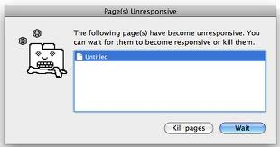
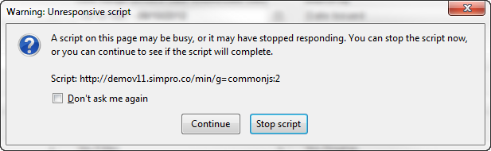
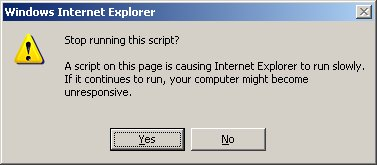
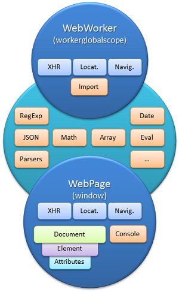

<!--

WARNING!! DON'T EDIT THE FILE README.md on the root of the project, that one is a GENERATED FILE!

You should just edit the source file at src/README.md - the one which stars with ## HTML5 JS APIs

-->

## HTML5 JS API - Part 1


Eduardo Silva @ [Avenue Code](http://www.avenuecode.com)

*esilva@avenuecode.com*

April 1st, 2014

---

## Agenda

- Webworkers
    - Motivation
    - Getting Started
    - Limitations
    - Use Cases

- Websockets
    - Motivation
    - Getting Started
    - Use Cases

---

## Webworkers - Motivation 
 
 
 
 

----

## Webworkers - Getting Started

- Web Workers come in 2 flavours:
  1. [Dedicated workers](http://www.whatwg.org/specs/web-apps/current-work/multipage/workers.html#dedicated-workers-and-the-worker-interface)
  1. [Shared workers](http://www.whatwg.org/specs/web-apps/current-work/multipage/workers.html#sharedworker)
- We are focusing on the Dedicated workers on this presentation

----

## Webworker API

1. First of all, we need to start a worker
```javascript
var worker = new Worker('js/worker.js');
```
1. Later we need to ask him to do something
```javascript
worker.postMessage();
```
1. Later, we have to tell him to stop
```javascript
self.close(); //Inside the worker
```

----

## Webworker - Available resources

1. navigator object
1. location object (read only)
1. XMLHttpRequest
1. setTimeout()/clearTimeout() and setInterval()/clearInterval()
1. Ability to import external scripts
1. Power of generating other Web Workers

----

## Webworker - Limitations

Web Workers *don't* have access to:

* DOM
* window object
* document object
* parent

----

## Webworker - Limitations

- 

---

## Webworker - Browser Support

- Most of modern browsers are supporting WebWorkers
- [This](http://caniuse.com/#search=worker) is a link for detailed information about it 

---

## Webworker - Use Cases

1. Text formatting of a long document
1. Syntax Highlighting
1. Image Processing
1. Audio API
1. File System API

---

## Websockets - Motivation

 

----

## Websockets - Motivation

 - *Polling:* Ask the server everytime if there is new message
 - *Long Polling:* Ask the server if there is a new message. In case, there is not, keep the
 connection open for a determined period of time
 - Both use HTTP protocol to send messages to the server, which wrapps them in a package with other
 informations, causing overhead in the application
 - Neither of these methods are 'bi-directional full duplex', so messages can be changed from one side
 to another at the same time

----

## Websockets - Motivation

 - The WebSocket specification defines an API which establish socket connections between a web browser and a server. In other words,
 there's a persistent connection between client and server and both can start sending data anytime.
 
 - To establish an HTTP connection, you first have to establish a TCP connection (SYN, SYN/ACK, ACK), then send a GET request with a pretty big header, then finally receive the server's response (along with another big header).

 - With an open WebSocket you simply receive the response (no request needed), and it comes with a much smaller header: from two bytes for small frames, up to 10 bytes for ridiculously large frames (in the gigabyte range).

 - [websocket vs Ajax performance comparison](https://www.websocket.org/quantum.html)

---

## Websockets - API

1. Firstly, you need to create your websocket:
```javascript
var connection = new WebSocket('ws://127.0.0.1:1234', 'echo-protocol');
```
1. Then, you can send messages
```javascript
connection.send('Hey server, whats up?');
```
1. You can close the connection whenever you feel you need to
```javascript
connection.close();
```

---

## Websockets - Limitations

 - Although major browsers support it, websockets is not in all most used browser versions
 - [Websockets Browser Support](http://caniuse.com/websockets)
 - Brand new technique. It may be adjusts for specific cases

---

## Websockets - Use Cases

 - Online games which many participants
 - Chat applications
 - Sports scores
 - Real-time updates on social networks
 - Real-time breaking-news updates

---

## Conclusion

- Webwokers comes to bring the great power of multithreading to the client-side. However, like all paralelism techniques,
  use it wisely, since the perfomance and complexibility can get worse.

- Websockets comes with a huge promisse of better performance on real-time applications and it reaches its goal. Consider
  using websockets whenever you need to use this kind of application.

---

## Learn more

1. [HTML5 Rocks - Webworkers](http://www.html5rocks.com/en/tutorials/workers/basics/)
1. [Webworker Specification](http://www.w3.org/TR/workers/)
1. [HTML5 Rocks - Websockets](http://www.html5rocks.com/en/tutorials/websockets/basics/)
1. [Developer Fusion](http://www.developerfusion.com/article/143158/an-introduction-to-websockets/)
1. [Websocket performance comparison](https://www.websocket.org/quantum.html)
1. [Websocket Specification](http://www.w3.org/TR/2009/WD-websockets-20091222/)

---

## Challenge

1. Build a simple chat for your Quizz App, so participants can share their thoughts on a specific question